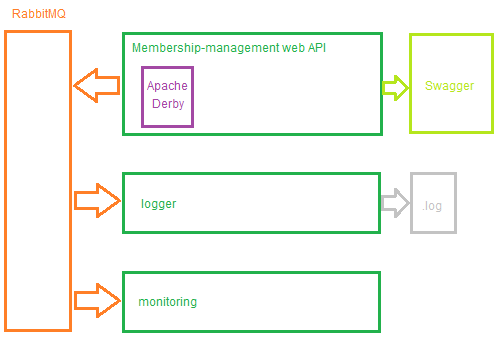

# Membership Management project


---

## Overview

The `MembershipManagement` project provides a way to manage teams, users and
their memberships.

This project is developed by **[Pierre Bouillon](https://www.linkedin.com/in/pierre-bouillon/)**
and **[Victor Varnier](https://www.linkedin.com/in/victor-varnier/)**

It is is split among three sub-projects:

- The [web API](./membership-management), which exposes the managed resources
  through a web REST API,
- A [logging client](./rabbitmq-clients/logger), which is logging every
  operation performed on the API,
- A [monitoring client](./rabbitmq-clients/monitoring), which is displaying the
  count, in real time, of the resources managed by the API.

## Installation

There is several ways of running the project:

### Dockerized with docker-compose

You can deploy the whole application stack (RabbitMQ, the API and the two
clients) using the provided `docker-compose.yml`.

To do so, ensure that your docker daemon is running and then type the following:

```console
~$ docker-compose up -d --build
```

This will **build the images** and **run them in the background**.

You can then reach the containers from the docker Desktop application or by
seeing their logs using

```console
~$ docker logs CONTAINER_ID
```

As for the logging client, you can open a terminal in the container and navigate
to the log file using the following command:

```console
~$ docker exec -it CONTAINER_ID bash
```

### Natively with powershell

Under `tools/` you will find a PowerShell script that will run the whole stack
and a script to test the API:

```console
~$ ./tools/local-run.ps1
```

The script will open three new terminals, with each one of them running a
Spring application from the project (the API, the monitoring client and the
logging client).

You will then see the python script logging actions in the console, which
correspond to the API calls it is performing.

> More information about the Python script are available in
> [its README](./tools/api-requests)

### From the top-level folder with the Makefile

If you have `make` installed, you can use the commands provided in the Makefile:

- `make docker-run` will build and run the whole docker stack along with the
  Python script to test the API
- `make docker-stop` will gracefully stop and remove the docker stack
- `make install` will install the needed dependencies of the project  
  (especially the ones needed for the Python script)
- `make run` will run the PowerShell script aforementioned;

## Structure

The overall architecture and the projects are structured as defined by the
following picture:



The API is managing its resources and can be reached using the generated Swagger
UI (see [the API's documentation](./membership-management/README.md)).

Whenever an operation is performed on it, the API will send a message to the
RabbitMQ broker on a specific topic. The logger and the monitoring client are
both listening to the broker on dedicated queues.

When receiving a message, the logging client will store a log of the operation
performed both in the console and in a file. For the monitoring client, it will
dynamically update the count of the users and the teams stored in the database
of the API.

## Pipelines

In order to continuously check the consistency and the correctness of our code,
we set up a continuous integration process with GitLab CI which can be found
[here](https://gitlab.telecomnancy.univ-lorraine.fr/sdisapp2021/membership-management/-/pipelines).

The CI is building all the projects using Gradle and JRE 15, and then running
the unit tests. Integration tests are available but should be run locally, with
your own RabbitMQ instance up and running. A `docker-compose` file is available
to run the development stack.
