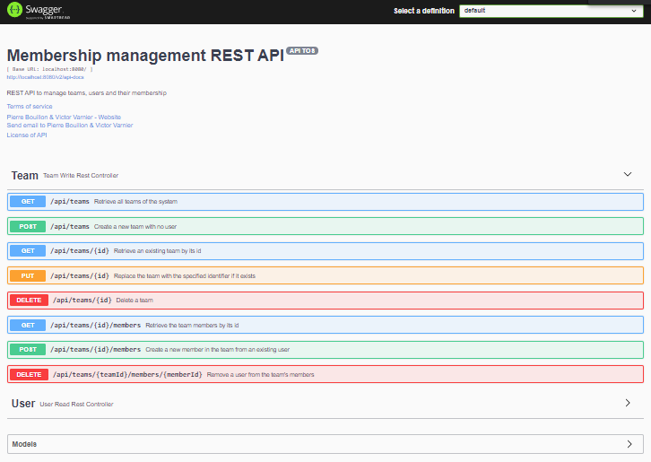

# MembershipManagement web API

---

# Overview

This project is developped by **[Pierre Bouillon](https://www.linkedin.com/in/pierre-bouillon/)**
and **[Victor Varnier](https://www.linkedin.com/in/victor-varnier/)**

`MembershipManagement` is a RESTful web API to manage teams, users and their memberships.  
Made with **Java 15**, **Java Spring** and **Apache Derby**, a web interface is accessible through the **Swagger UI**

## Structure

> For the initial API documentation, please refer to [the wiki](https://gitlab.telecomnancy.univ-lorraine.fr/sdisapp2021/membership-management/-/wikis/home)

The overall architecutre is the following:

> **TODO Victor's schema**

## Architecture principles and other tools

### CQRS

### Mapping

## Code Quality

### CI

### Unit tests

### Integration tests
