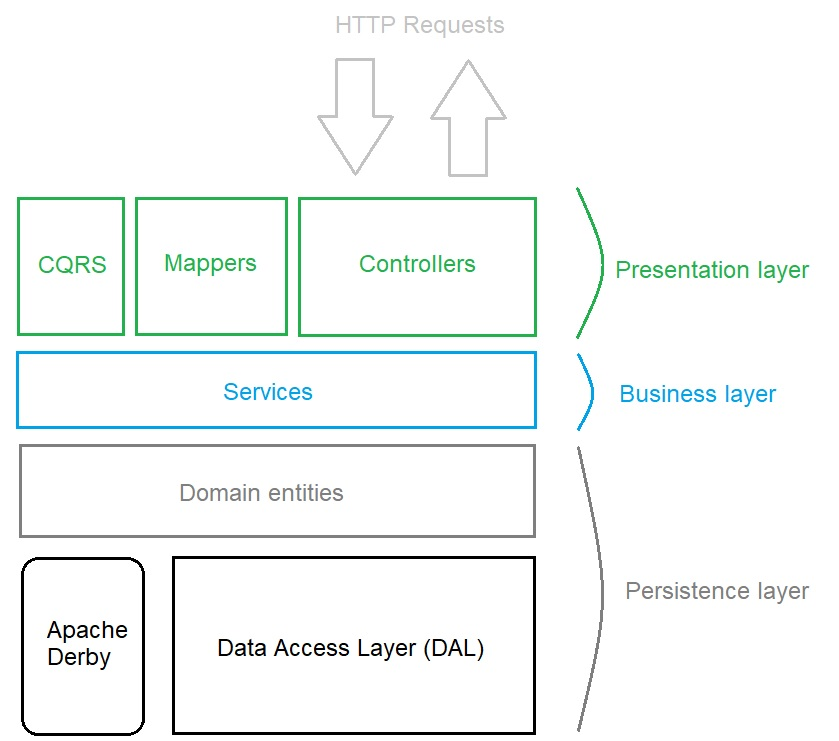

# Membership Management web API

## Overview

`MembershipManagement` is a RESTful web API to manage teams, users and their
memberships. Made with **Java 15**, **Java Spring** and **Apache Derby**, a web
interface is accessible through the **Swagger UI** (accessible by default on
http://localhost:8080/swagger-ui/#/ when the project is running)

## Structure

> For the initial API documentation, please refer to [the wiki](https://gitlab.telecomnancy.univ-lorraine.fr/sdisapp2021/membership-management/-/wikis/home)

The overall architecture is the following:

## Architecture principles and other tools

In order to help us to build a robust and efficient API, we created our
project around some specific additional technologies.

### CQRS

CQRS, or Command Query Responsibility Segregation, is a way to design
a system in a way such that the read operations are completely
separated from the write operations.  

We applied this principle to our controllers by splitting them between
read- and write-only controllers. By doing so, each payload received
is holding all the data needed to perform an operation, without any
additional one which may be misused or provide too much information.

This is resulting in several components with a specific
closed scope that can only access and use the minimal amount
of data it needs to operate and in an increased loose coupling
(see the [Law of Demeter](https://en.wikipedia.org/wiki/Law_of_Demeter)).

### DTO and Mapping

To ease the manipulation of our entities across the various layers of the
application, we used [MapStruct](https://mapstruct.org/).

This tool help us map our commands and queries (from CQRS) to our domain
entities when receiving a request; and from the entities to their associated
DTO when providing and building the response.

DTO are used in a way that allows us to independently evolve our domain from what the
client is receiving, without coupling our persistence layer and the presentation
layer.

By doing so, each of our layer can be isolated and only have a single purpose
that does not impact any other.

## Code Quality

Despite being quite simple, we wanted to ensure that our code met some of the
quality standards widely used in many projects.

### Logging

First of all, this API is meant to be ran without supervision.

To ensure that it's working and investigate issues without having to stop the
whole application, we used [Log4j2](https://logging.apache.org/log4j/2.x/) to
log the actions currently executed by the API.
