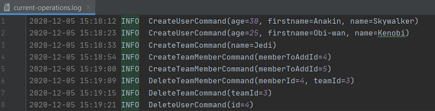

# Membership Management logging client

## Overview

`MembershipManagement Logger` is a logging client used to record all the operations carried out by the RESTful web API. Made with **Java 15**, **Java Spring** and **Log4j2**.

Logs are stored in a rolling file as well as in the console for visibility purposes. By default, the current log file is generated in `./logs/current-operations.log` (assuming you're in the logger's project repository). The rolling log files will be generated following this structure: `./logs/operations-backup-%d{dd-MM-yy}-%i.log`.

> `%d` is the date formatted as the day, the month and the year on two digits separated by `-`. For example `05-12-20`.

> `%i` is the index of the generated file for this day. For example if this file is the second one generated in a day `%i` will result in `2`.

Multiple policies have been configured to obtained a better log management. A size-based policy has been applied to create a new log file when the size of the current log file exceeds 1 MB.

Moreover, when three log files have already been generated and the current one is exceeding its maximum size, then the system will automatically replace the oldest one's content by the content of the current log file. The latter will then be reset to log only the newest operations.

