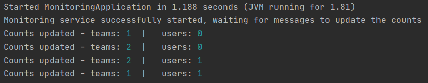

# Membership Management monitoring client

## Overview

This client is used to monitor the number of resources tracked by the API.

Listening to the RabbitMQ messages sent, it will dynamically update the count
of the total number of users and teams in the console.

> Since the client has no persistence, the count will always start at 0

Here is an example of the client running while operations are performed on the
API:

> The client will wait for an operation to be performed before displaying the
> count in real time
